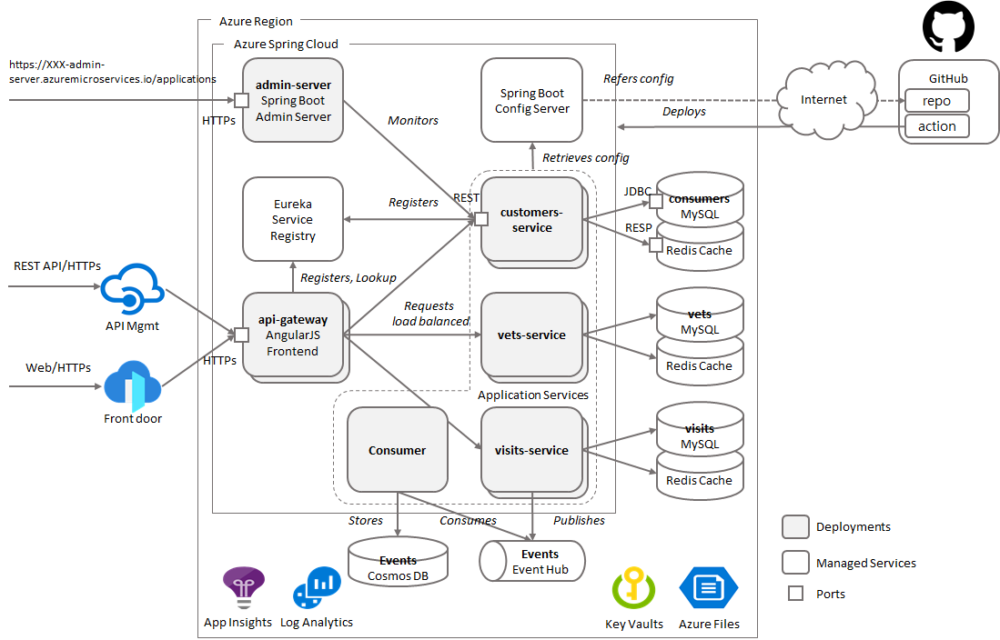
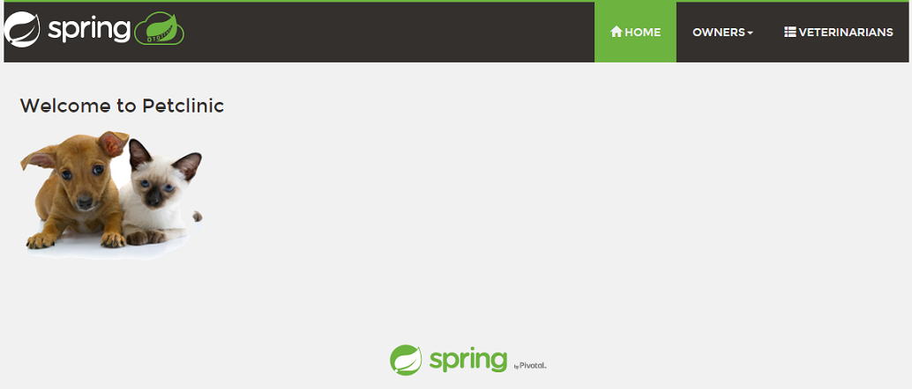
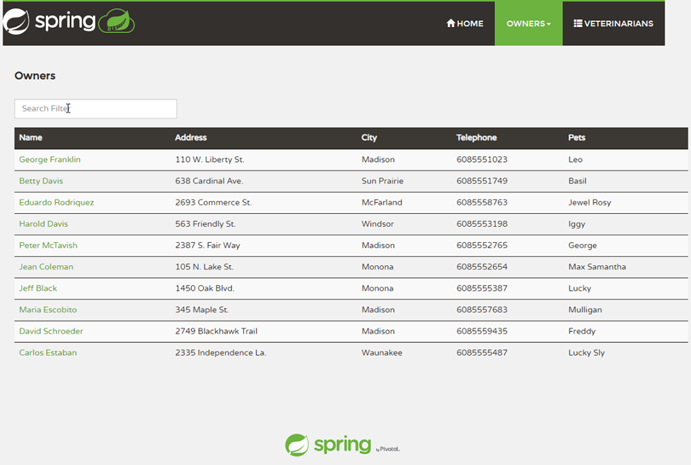
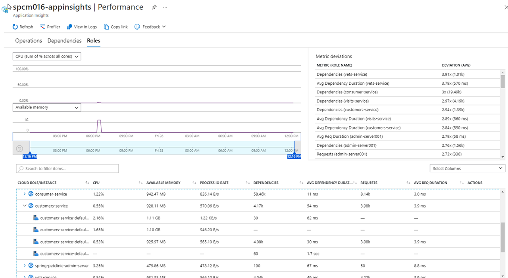
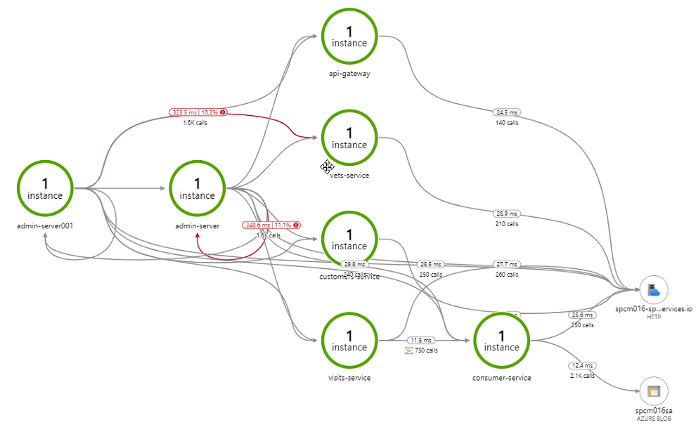
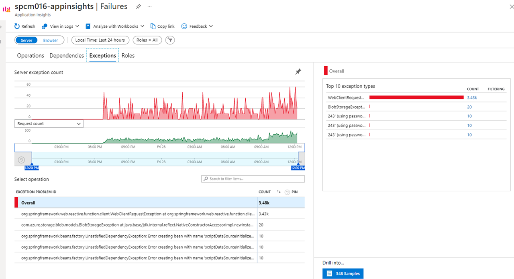

# Spring Boot PetClinic Microservices Application Deployed to Azure Spring Apps

This example shows you how to deploy an existing Java Spring Boot/Cloud application to Azure Spring Apps. When you're finished, you can continue to manage the application with Azure services via the Azure CLI, Bicep templates or switch to using the Azure Portal. 

> Refer to the [App Templates](https://github.com/microsoft/App-Templates) repo Readme for more samples that are compatible with [azure dev cli](https://github.com/Azure/azure-dev/).

## Features 

This project provides the following features:

* Build existing Spring Boot/Cloud applications
* Provision Azure Spring Apps service and Azure Services using Bicep template from commandline or/and portal. See [what is Bicep](https://docs.microsoft.com/en-us/azure/azure-resource-manager/bicep/overview?tabs=bicep)
* Deploy applications to Azure
* Bind applications to Azure services
* Open and test the applications
* Monitor the applications

## Architecture and Azure Services



* All app components communicate with KeyVaults to retrieve sensitive information stored in secrets
* All app components bound to Azure Files as permanent storage
* All app components with data acess gets second level cache on Redis
* All components bound to Log Analytics to send logs and metrics
* Endpoints to `admin-server` and `api-gateway` for extenal access
* config-server in Azure Spring Apps gets the app configs from repos on GitHub with authentication
* CI/CD by GitHub Actions are added with appropriate authentication to access the resources on Azure

## Getting Started

### Prerequisites

- Bash on Ubuntu host or WSL2, Cloudshell
- [Azure CLI version 2.17.1, higher or latest](https://docs.microsoft.com/cli/azure/install-azure-cli?view=azure-cli-latest) 
- [Bicep latest](https://docs.microsoft.com/en-us/azure/azure-resource-manager/bicep/install)
- [Java 11](https://jdk.java.net/11/) 
- [Maven latest](https://maven.apache.org/download.cgi) 
- [MySQL CLI latest](https://dev.mysql.com/downloads/shell/)
- [Git latest](https://git-scm.com/)
- [jq utility latest](https://stedolan.github.io/jq/download/) 

### Installation

Before you start, install/udpate the Azure Spring Apps extension for the Azure CLI using following commands

```bash
az extension add --name spring
```

Or 

```bash
az extension update --name spring
```    

### Quickstart

1. Create a new folder and clone the repositories to your environment 

```bash
mkdir [your source code folder name]
cd [your source code folder name]
git clone [your source code repo URL, or https://github.com/Azure-Samples/apptemplates-microservices-spring-app-on-AzureSpringApps]
git clone [your config repo URL, or https://github.com/euchungmsft/spring-petclinic-microservices-config]
```

2. Change directory and build the project.

```bash
cd apptemplates-microservices-spring-app-on-AzureSpringApps
mvn clean package -DskipTests -Denv=cloud
``` 

3. Config your project

```bash
mv .env-sample .env
``` 

Open .env with your text editor and update PROJECT_NAME, SUBSCRIPTION, SP_NAME, MY_UPN at least and REGION optionally only if necessary. PROJECT_NAME is prefix for all resources to be created. SUBSCRIPTION is your Azure Subscription ID, SP_NAME is Service Principal name to be created, MY_UPN is your Azure login id in email address format 

```yaml
PROJECT_NAME=[your project name, to give names to all resoures]

RESOURCE_GROUP=${PROJECT_NAME}-rg
REGION=westus
..
..
``` 

4. Login to Azure from CLI

```bash
az login --use-device-code
```

5. Create project resources

```bash
bin/init.sh
```

6. Load all required variables and set defaults in your environment 

```bash
source ./.env
az account set --subscription ${SUBSCRIPTION}
```

7. Provision infrastructure components and Azure Spring Apps

```bash
az deployment group create \
 -g $RESOURCE_GROUP \
 -f iac/bicep/spc-main.bicep \
 --parameters location=$REGION \
  projectName=$PROJECT_NAME
```

8. Provision Azure services

```bash
az deployment group create \
 -g $RESOURCE_GROUP \
 -f iac/bicep/services-main.bicep \
 --parameters location=$REGION \
  projectName=$PROJECT_NAME \
  database_name=$MYSQL_DATABASE_NAME \
  mysql_adminUsername=$MYSQL_SERVER_ADMIN_NAME \
  mysql_adminPassword=$MYSQL_SERVER_ADMIN_PASSWORD \
  servicePrincipal="{ \"clientId\": \"$AZURE_CLIENT_ID\", 
  \"tenantId\": \"$AZURE_TENANT_ID\", 
  \"objectId\": \"$AZURE_OBJECT_ID\" }"
``` 

9. Config Log Analytics

```bash
bin/loganalytics-diagnostics.sh
``` 

To add Application Insights in your environment, on your portal, select your spring apps instance, click on Application Insights blade on the left, check on 'Enable Application Insights', Click on 'Create New' link, give it a new name for your App Insights instance.

 

10. Give permission to access KeyVault secrets

```bash
az keyvault set-policy --name $KEY_VAULT \
--upn $MY_UPN \
--secret-permissions all

az keyvault set-policy --name $KEY_VAULT \
--object-id $AZURE_OBJECT_ID \
--secret-permissions all
```

11. Initialize MySQL

```bash
mysql -u ${MYSQL_SERVER_ADMIN_LOGIN_NAME} \
 -h ${MYSQL_SERVER_FULL_NAME} \
 -P 3306 "--password=$MYSQL_SERVER_ADMIN_PASSWORD" \
 -e "-- CREATE DATABASE $MYSQL_DATABASE_NAME;
CREATE USER 'root' IDENTIFIED BY '$MYSQL_DATABASE_NAME';
GRANT ALL PRIVILEGES ON petclinic.* TO 'root';
CALL mysql.az_load_timezone();
SELECT name FROM mysql.time_zone_name;
quit
"
```

12. Adding Storage Account

```bash
KEY0=`az storage account keys list -g $RESOURCE_GROUP --account-name $STORAGE_ACCOUNT_NAME  | jq -r .[0].value`
echo $KEY0
az spring storage add \
 --storage-type StorageAccount \
 --account-key $KEY0 \
 --account-name $STORAGE_ACCOUNT_NAME \
 --name $SHARE_NAME
``` 

13. Config your PetClinic App

Open `application.yml` in spring-petclinic-microservices-config repo

Update all resource names with your project name and all values under `spring.cloud.azure.eventhub`

```yaml
spring:
  config:
    activate:
      on-profile: mysql
...
  cloud:
    azure:
      eventhub:
        connection-string: <your event hub connection string>
        checkpoint-storage-account: <your storage account name for checkpoint>
        checkpoint-access-key: <your storage account access key for checkpoint>
        checkpoint-container: <your blob container name for checkpoint>
        namespace: <your event hub namespace>
    stream:
      function:
        definition: consume;supply
      bindings:
        consume-in-0:
          destination: <your event hub name>
          group: $Default
        supply-out-0:
          destination: <your event hub name>
```  

Commit and push the changes

```bash
git remote add origin https://github.com/<your gh account name>/spring-petclinic-microservices-config
git push -u origin master
``` 

14. Config your Azure Spring App

Back to `spring-petclinic-microservices`, make a copy `application.yml.example` to `application.yml` 

```bash
cp application.yml.example application.yml
```

Customize `application.yml` 

```yaml
spring:
  cloud:
    config:
      server:
        git:
          uri: [your config repo url]
          username: [your login id at GitHub]
          password: [your developer token at GitHub]
          label: main
        native:
          search-locations: classpath:.
  profiles:
    active: native 
```     

Your developer token is from your GitHub account setttings. See [this](https://docs.github.com/en/authentication/keeping-your-account-and-data-secure/creating-a-personal-access-token) for further details 

Add app configs to your Azure Spring Apps

```bash
az spring config-server set \
 --config-file application.yml \
 --name ${SPRING_CLOUD_SERVICE}
``` 

15. Add cache config

```bash

KEY0=`az redis list-keys --name ${PROJECT_NAME}-redis --resource-group ${RESOURCE_GROUP} | jq -r .primaryKey`
echo "{\"singleServerConfig\":{\"address\": \"redis://${PROJECT_NAME}-redis.redis.cache.windows.net:6379\", \"password\": \"$KEY0\"}}" > redisson.json
cat redisson.json

cp redisson.json spring-petclinic-${CUSTOMERS_SERVICE}/src/main/resources/
cp redisson.json spring-petclinic-${VETS_SERVICE}/src/main/resources/
cp redisson.json spring-petclinic-${VISITS_SERVICE}/src/main/resources/ 

```

16. Build your app

```bash
mvn clean package -DskipTests -Denv=cloud
```

17. Create apps 

```bash
bin/spring-apps.sh create api-gateway
bin/spring-apps.sh create admin-server
bin/spring-apps.sh create customers-service
bin/spring-apps.sh create vets-service
bin/spring-apps.sh create visits-service
bin/spring-apps.sh create consumer-service
``` 

18. Append storage to the apps

```bash
bin/spring-apps.sh append-persistent-storage customers-service
bin/spring-apps.sh append-persistent-storage vets-service
bin/spring-apps.sh append-persistent-storage visits-service
bin/spring-apps.sh append-persistent-storage consumer-service
```

19. Deploy apps

```bash
bin/spring-apps.sh deploy api-gateway
bin/spring-apps.sh deploy admin-server
bin/spring-apps.sh deploy customers-service
bin/spring-apps.sh deploy vets-service
bin/spring-apps.sh deploy visits-service
bin/spring-apps.sh deploy consumer-service
```

20. Browse logs

```bash
bin/spring-apps.sh logs api-gateway
bin/spring-apps.sh logs admin-server
bin/spring-apps.sh logs customers-service
bin/spring-apps.sh logs vets-service
bin/spring-apps.sh logs visits-service
bin/spring-apps.sh logs consumer-service
``` 

## Demo

To run the demo, follow these steps:

1. Demo deployments


2. Demo PetClinic app

Open PetClinic from your Browser

```
https://[your project name]-springcloud-api-gateway.azuremicroservices.io
```


Navigate from menu on the top




 

3. Demo Azure Monitor 

Open your Application Insights instance 


Navigate to the Performance blade


Click on Dependencies, you can see the performance number for dependencies to the services


Click on Roles, you can see the performance number to compare across instances and roles



Navigate to the Application Map blade



Navigate to the Failures blade


Click on Exceptions, you can see a collection of exceptions



Click on an exception to see the end-to-end transaction and stacktrace in context


Navigate to the Metrics blade


Navigate to Live Metrics blade, you can see live metrics on screen with low latencies < 1 second


4. Demo API test from command line

For the app services

```bash
curl -X GET https://${SPRING_CLOUD_SERVICE}-${API_GATEWAY}.azuremicroservices.io/api/customer/owners
curl -X GET https://${SPRING_CLOUD_SERVICE}-${API_GATEWAY}.azuremicroservices.io/api/customer/owners/4
curl -X GET https://${SPRING_CLOUD_SERVICE}-${API_GATEWAY}.azuremicroservices.io/api/customer/owners/ 
curl -X GET https://${SPRING_CLOUD_SERVICE}-${API_GATEWAY}.azuremicroservices.io/api/customer/petTypes
curl -X GET https://${SPRING_CLOUD_SERVICE}-${API_GATEWAY}.azuremicroservices.io/api/customer/owners/3/pets/4
curl -X GET https://${SPRING_CLOUD_SERVICE}-${API_GATEWAY}.azuremicroservices.io/api/customer/owners/6/pets/8/
curl -X GET https://${SPRING_CLOUD_SERVICE}-${API_GATEWAY}.azuremicroservices.io/api/vet/vets
curl -X GET https://${SPRING_CLOUD_SERVICE}-${API_GATEWAY}.azuremicroservices.io/api/visit/owners/6/pets/8/visits
curl -X GET https://${SPRING_CLOUD_SERVICE}-${API_GATEWAY}.azuremicroservices.io/api/visit/owners/6/pets/8/visits
```

For the Actuators

```bash
curl -X GET https://${SPRING_CLOUD_SERVICE}-${API_GATEWAY}.azuremicroservices.io/actuator/
curl -X GET https://${SPRING_CLOUD_SERVICE}-${API_GATEWAY}.azuremicroservices.io/actuator/env
curl -X GET https://${SPRING_CLOUD_SERVICE}-${API_GATEWAY}.azuremicroservices.io/actuator/configprops
curl -X GET https://${SPRING_CLOUD_SERVICE}-${API_GATEWAY}.azuremicroservices.io/api/customer/actuator
curl -X GET https://${SPRING_CLOUD_SERVICE}-${API_GATEWAY}.azuremicroservices.io/api/customer/actuator/env
curl -X GET https://${SPRING_CLOUD_SERVICE}-${API_GATEWAY}.azuremicroservices.io/api/customer/actuator/configprops
``` 


## Resources <TBD>

- [document](README_CICD.md) for instructions for CI/CD

- [document](README_all.md) for instructions with all details
- [document](docs/petclinic-swagger.md) for APIM integration with Swagger/OAS3
- [document](docs/petclinic-test.md) for managed testing pm Azure Load Test
- [document](docs/petclinic-cicd.md) for CI/CD on Github Actions in detail
