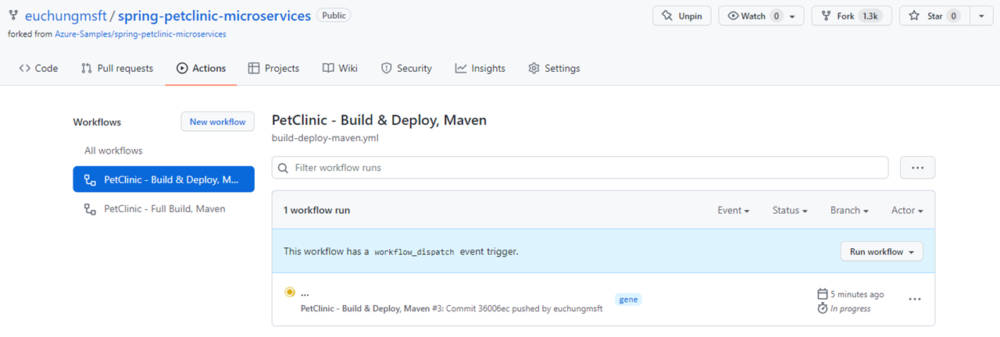
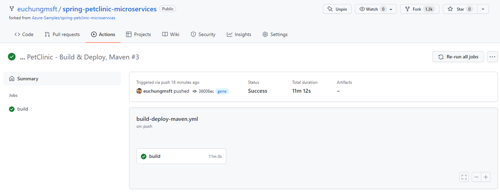

# Spring Boot PetClinic Microserices on GitHub Actions

This example shows you how to deploy PetClinic Microserices application by using GitHub Action as CI/CD example to Azure Spring Apps.

## Getting Started

### Prerequisites

- Complete all instructions listed [here](README.md)
- Service Principal generated at early steps [here](README.md#configure-your-project)

You need two Azure credentials stored on the repo. One's for Azure login from CLI, the other's for AZURE_CLIENT_SECRET to pass to the apps as the environment variables. From the top menu on the repo, select Settings, click on Secrets on left menu and click on Actions. Click on New repository secret, and save your Service Principal details as AZURE_CREDENTIALS01 that you saved in the initial steps. And another is AZURE_CLIENT_SECRET as AZURE_CREDENTIALS02, repeat the steps and save

### Installation

No further installation's required once you have forked and stored AZURE_CREDENTIALS on your repo

### Quickstart

Enable workflows and run manually for the demo

## Demo

Reviewing workflows, navigate to Actions on your repo

To run the demo, follow these steps:

 

Click on "Run workflow" on the right

It looks like this when workflows's running

Get all details from each steps

It looks like this when it's done successfully, 

        

## Automated CI/CD in practice

Find this [document](docs/petclinic-cicd.md) for further details 

## Resources <TBD>

- [document](README_all.md) for instructions with all details
- [document](docs/petclinic-swagger.md) for APIM integration with Swagger/OAS3
- [document](docs/petclinic-test.md) for managed testing pm Azure Load Test
- [document](docs/petclinic-cicd.md) for CI/CD on Github Actions
