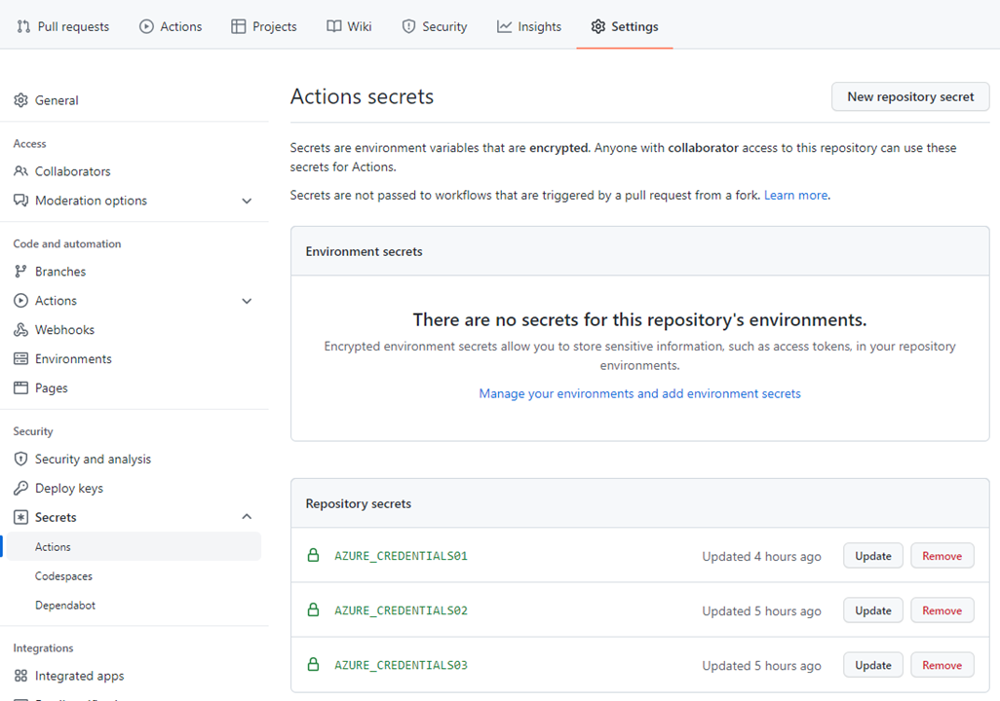
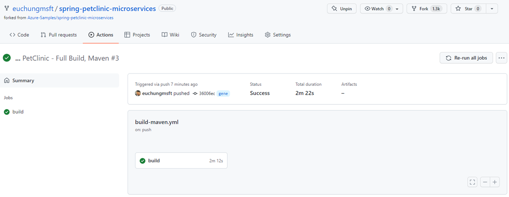
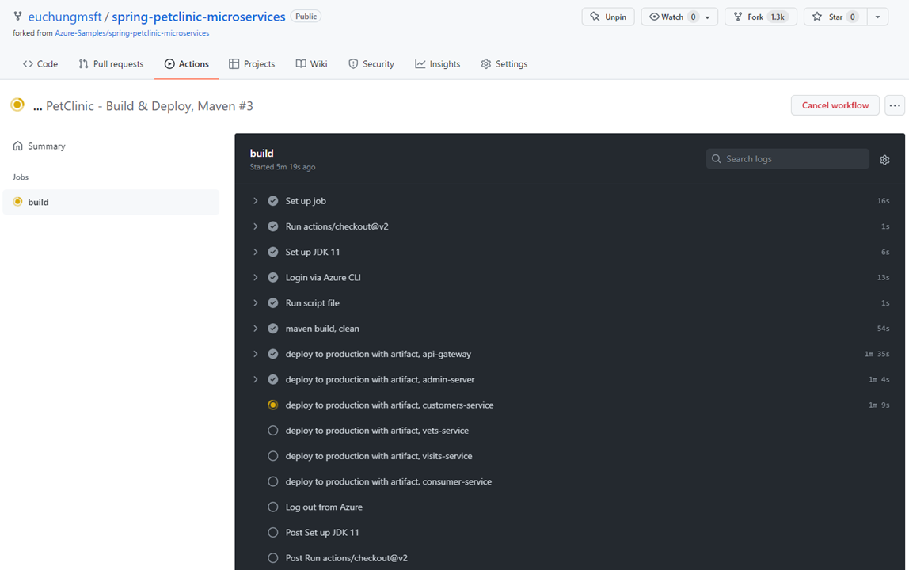
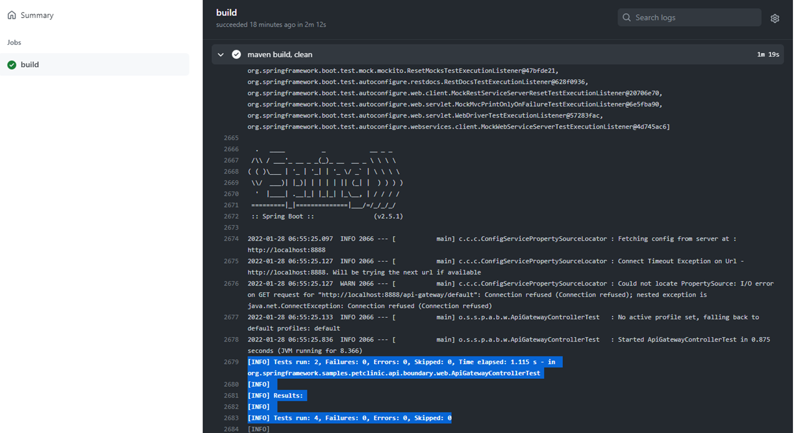

# Spring Boot PetClinic Microserices on GitHub Actions

This example shows you how to deploy an existing Java Spring Boot/Cloud application to Azure Sprint Apps. When you're finished, you can continue to manage the application with Azure services via the Azure CLI, Bicep templates or switch to using the Azure Portal. 

## Features 

This example provides the following features:

  * CI/CD Workflow reviews
  * Configuring workflows for CI/CD

## Getting Started

### Prerequisites

- Complete all instructions listed [here](README.md)
- Service Principal generated at early steps [here](README.md)

You need to add these variables to store first in your repo. Find Settings -> Security -> Secrets -> Actions

* AZURE_SUBSCRIPTION_ID
* AZURE_TENANT_ID
* AZURE_CLIENT_ID
* AZURE_CREDENTIALS01
* AZURE_CREDENTIALS02

You've already got these when you create Service Principal in the inital steps. AZURE_CREDENTIALS01 is return of `az ad sp create-for-rbac` in json format. AZURE_CREDENTIALS02 is AZURE_CLIENT_SECRET/`clientSecret` alone 

### Installation

No installation's required once you have forked and stored AZURE_CREDENTIALS on your repo

### Quickstart

Enable workflows and run manually for the demo

## Demo

Reviewing workflows, navigate to Actions on your repo

To run the demo, follow these steps:

 

Click on the latest item

It looks like this for CI workflows

It looks like this when it's working

When it's successfully done with test steps, it looks like this

        

## Automated CI/CD in practice

Find this [document](docs/petclinic-cicd.md) for further details 

## Resources <TBD>

- [document](README_all.md) for instructions with all details
- [document](docs/petclinic-swagger.md) for APIM integration with Swagger/OAS3
- [document](docs/petclinic-test.md) for managed testing pm Azure Load Test
- [document](docs/petclinic-cicd.md) for CI/CD on Github Actions in detail
