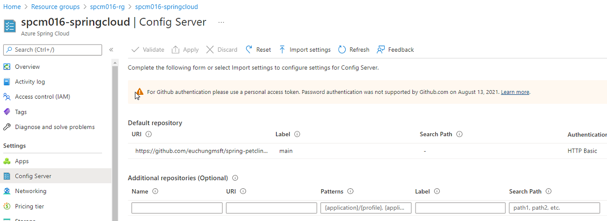

# Deploy Spring Boot apps using Azure Spring Apps and Azure Services

Azure Spring Apps enables you to easily run a Spring Boot applications on Azure. It manages the infrastructure of Spring Cloud applications hiding all complications of container and container managements so developers can focus on their code. It provides lifecycle management using comprehensive monitoring and diagnostics, configuration management, service discovery, CI/CD integration, blue-green deployments, and more.

> Note: Azure Spring Cloud is now Azure Spring Apps as of today (May-22, 2022)

This example shows you how to deploy an existing Java Spring Boot/Cloud application to Azure. When you're finished, you can continue to manage the application with Azure services via the Azure CLI, Bicep templates or switch to using the Azure Portal.

It's forked from [Azure-Samples/spring-petclinic-microservices](https://github.com/Azure-Samples/spring-petclinic-microservices) and originally from [spring-petclinic/spring-petclinic-microservices](https://github.com/spring-petclinic/spring-petclinic-microservices). Code change's minimized, all deployment models work properly which introduced in the previous repos such as

* [Starting services locally without Docker](docs/README-petclinic.md#starting-services-locally-without-docker)
* [Starting services locally with docker-compose](docs/README-petclinic.md#starting-services-locally-with-docker-compose)
* [Deploying Spring Boot apps using Azure Spring Apps and MySQL](docs/README-azure-samples.md)

You will need to check these config repos too. They provide app configs to your runtime.

* [euchungmsft/spring-petclinic-microservices-config](https://github.com/euchungmsft/spring-petclinic-microservices-config) - configuration as example on public
* [euchungmsft/spring-petclinic-microservices-config-private](https://github.com/euchungmsft/spring-petclinic-microservices-config-private) - working configuration on private protected by GitHub authentication

## Contents

Deploy Spring Boot apps using Azure Spring Apps and Azure Services

* [Introduction](#deploy-spring-boot-apps-using-azure-spring-cloud-and-azure-services)
  * [What will you experience](#what-you-will-experience)
  * [What you will need](#what-you-will-need)

* [The App, PetClinic](#the-app-petclinic)
  * [The application architecture](#the-application-architecture-with-all-components-and-elements)
  * [Deployment architecture - Basic](#deployment-architecture---basic)
  * [Deployment architecture - Standard](#deployment-architecture---standard)

* [Deploying PetClinic App, step by step instruction](#deploying-petclinic-app-step-by-step-instruction)
  * [Cloning the repo](#clone-and-build-the-repo)
  * [Configuring your project](#configure-your-project)
  * [Provisioning Azure Services](#provision-azure-services)
  * [Configure and integrate the Azure services](#configure-and-integrate-the-azure-services)
  * [Configure PetClinic app](#configure-petclinic-app)
  * [Configure config-server by Azure Spring Apps](#configure-config-server-by-azure-spring-cloud)
  * [Deploy your apps](#deploy-your-apps)
  * [Testing the app](#testing-your-apps)
  * [Monitoring the app](#monitoring-your-app)

* [PetClinic Swagger/OAS3 for API Management Integration](#petclinic-swaggeroas3-for-api-management-integration)

* [Fully managed testing for PetClinic app](#fully-managed-testing-for-petclinic-app)

* [PetClinic on Automated CI/CD with GitHub Action](#petclinic-on-automated-cicd-with-github-action)
  * [CI and CI/CD Workflows](#ci-and-cicd-workflows)
  * [Configure workflows for CI](#configure-workflows-for-ci)
  * [Configure workflows for CI/CD](#configure-workflows-for-cicd)
  * [Reviewing workflows](#reviewing-workflows)

* [Automated CI/CD in practice](#automated-cicd-in-practice)

## What you will experience

You will

- Build an existing Spring Boot/Cloud applications
- Provision Azure Spring Apps service and Azure Services using Bicep template from commandline or/and portal. See [what is Bicep](https://docs.microsoft.com/en-us/azure/azure-resource-manager/bicep/overview?tabs=bicep)
- Deploy applications to Azure
- Bind applications to Azure services
- Open and test the applications
- Monitor the applications
- Integrate with APIM using Swagger doc
- Automate deployments using GitHub Actions
- Find how to store sensitive informtion to Azure Key Vault Secret and how to use/manage them
- Find how to implement second level cache transparently using Azure Cache for Redis for better performance
- Find how to implement Spring Cloud Stream backed by Azure Event Hub replacing Kafka you might have been using
- Find how to implement Spring Data backed by Azure CosmosDB replacing MongoDB 

## What you will need

In order to deploy a Java app to cloud, you need an Azure subscription. If you do not already have an Azure 
subscription, you can activate your [MSDN subscriber benefits](https://azure.microsoft.com/pricing/member-offers/msdn-benefits-details/) or sign up for a [free Azure account]((https://azure.microsoft.com/free/)).

In addition, you will need the following:

| [Azure CLI version 2.17.1, higher or latest](https://docs.microsoft.com/cli/azure/install-azure-cli?view=azure-cli-latest) 
| [Bicep latest](https://docs.microsoft.com/en-us/azure/azure-resource-manager/bicep/install)
| [Java 11](https://jdk.java.net/11/) 
| [Maven latest](https://maven.apache.org/download.cgi) 
| [MySQL CLI latest](https://dev.mysql.com/downloads/shell/)
| [Git latest](https://git-scm.com/)
| [jq utility latest](https://stedolan.github.io/jq/download/)

> Note: The Bash shell. While Azure CLI should behave identically on all environments, shell semantics vary. Therefore, only bash can be used with the commands in this repo. WSL2/Ubuntu is my recommendation to complete this example. See [this](https://docs.microsoft.com/en-us/windows/wsl/install) for WSL Installation on your Windows, see [this](https://ubuntu.com/wsl) for Ubuntu (18+) download. Azure Cloud Shell is another good choice too. See [this](https://docs.microsoft.com/en-us/azure/cloud-shell/overview)

### Before you start

Before you start, install the Azure Spring Apps extension for the Azure CLI using the following command

```bash
    az extension add --name spring-cloud
```

> Note: `spring-cloud` CLI extension `2.1.0` or later is a pre-requisite to enable the latest Java in-process agent for Application Insights. If you already have the CLI extension, you may need to upgrade to the latest using --

> Note: Brand new extension's available as of today (May-25, 2022) as it's renamed to Azure Spring Apps. Try to update from your command line

```bash
    az extension update --name spring-cloud
```

## The App, PetClinic

### The application architecture with all components and elements

Based on the PetClinic App, [Azure-Samples/spring-petclinic-microservices](https://github.com/Azure-Samples/spring-petclinic-microservices) we've added Azure services with integration, and Consumer service which communicates with the app services over Event Hub


* All app components communicate with KeyVaults to retrieve sensitive information stored in secrets
* All app components bound to Azure Files as permanent storage
* All app components with data acess gets second level cache on Redis
* All components bound to Log Analytics to send logs and metrics
* Endpoints to `admin-server` and `api-gateway` for extenal access
* config-server in Azure Spring Apps gets the app configs from repos on GitHub with authentication
* CI/CD by GitHub Actions are added with appropriate authentication to access the resources on Azure

### Deployment architecture - Basic 

Simple and basic deployment model for the purpose of test


* Where the customer doesn't care about network dedication 
* Each of Azure Services allows access with access control over the network

### Deployment architecture - Standard

Secure and dedicated deployment for serious purpose


* All app components are deployed in the customer VNet which enables them to access directly to its components such as AKS, load balancers and so on
* Each of Azure Services allow to access over private endpoints deployed in the VNet

## Deploying PetClinic App, step by step instruction

### Clone and build the repo

> Note: My recommendation is to start to fork these repos to yours first than cloning these right away from this repo. It helps you to run later half of this document, to config GitHub Action, you need to get your developer token for authentication, and to store your credentials in the repo

Create a new folder and clone the repositories to your environment

```bash
mkdir [your source code folder name]
cd [your source code folder name]
git clone [your source code repo URL, or https://github.com/microsoft/csu-digiapps-cm-java_on_springcloud]
git clone [your config repo URL, or https://github.com/euchungmsft/spring-petclinic-microservices-config]
```

spring-petclinic-microservices is source code and working repo, spring-petclinic-microservices-config is for the configuration repo to push back to GitHub. 

Change directory and build the project.

```bash
cd spring-petclinic-microservices
mvn clean package -DskipTests -Denv=cloud
```

This will take a few minutes.

### Configure your project

Rename .env-example to .env and update it

```bash
mv .env-example .env
```

Open .env

```yaml
PROJECT_NAME=[your project name, to give names to all resoures]

RESOURCE_GROUP=${PROJECT_NAME}-rg
REGION=westus
..
..
```

PROJECT_NAME is for automatically naming the resources. MY_UPN is User Principal Name of your Azure portal account. Check this from Azure Active Directory - Users

Login to the Azure CLI and choose your active subscription. Be sure to choose the active subscription that is whitelisted for Azure Spring Apps

```bash
az login 
```
or 

```bash
az login --use-device-code
```

You need a Resource Group and Service Principal to authenticate from your environment. Simply run `bin/init.sh`, it consist of steps listed below

```bash
bin/init.sh
```

1. Creating a Resource Group
2. Creating a Service Principal
3. Updating .env
4. Set defaults in your environment with az command

and you'll get something like this as a result of step-2. Save it for later steps

```json
{
  "clientId": "XXXXXXXX-XXXX-XXXX-XXXX-XXXXXXXXXXXX",
  "clientSecret": "XXXXXXXXXXXXXXXXXXXXXXXXXXXXXXXXXX",
  "subscriptionId": "XXXXXXXX-XXXX-XXXX-XXXX-XXXXXXXXXXXX",
  "tenantId": "XXXXXXXX-XXXX-XXXX-XXXX-XXXXXXXXXXXX",
  "activeDirectoryEndpointUrl": "https://login.microsoftonline.com",
  "resourceManagerEndpointUrl": "https://management.azure.com/",
  "activeDirectoryGraphResourceId": "https://graph.windows.net/",
  "sqlManagementEndpointUrl": "https://management.core.windows.net:8443/",
  "galleryEndpointUrl": "https://gallery.azure.com/",
  "managementEndpointUrl": "https://management.core.windows.net/"
}
```

.env must be updated like this already. Check AZURE_CLIENT_ID, AZURE_CLIENT_SECRET, AZURE_TENANT_ID if they are correct

```yaml
AZURE_CLIENT_ID=XXXXXXXX-XXXX-XXXX-XXXX-XXXXXXXXXXXX
AZURE_CLIENT_SECRET=XXXXXXXXXXXXXXXXXXXXXXXXXXXXXXXXXX
AZURE_TENANT_ID=XXXXXXXX-XXXX-XXXX-XXXX-XXXXXXXXXXXX
AZURE_OBJECT_ID=XXXXXXXX-XXXX-XXXX-XXXX-XXXXXXXXXXXX
```

AZURE_OBJECT_ID is automatically updated in the shell script with command like below. Once you've done `bin/init.sh` successfully, you don't have to run this separately

```bash
az ad sp show --id $AZURE_CLIENT_ID | jq -r .objectId
```

### Provision Azure Services

Load all required variables in your environment

```bash
source ./.env
```

Set default sunscription to use in this example

```bash
az account set --subscription ${SUBSCRIPTION}
```

Provision infrastructure components and Azure Spring Apps

```bash
az deployment group create \
 -g $RESOURCE_GROUP \
 -f iac/bicep/spc-main.bicep \
 --parameters location=$REGION \
  projectName=$PROJECT_NAME
```

Or alternatively on the portal,

[](https://portal.azure.com/#create/Microsoft.Template/uri/https%3A%2F%2Fraw.githubusercontent.com%2Feuchungmsft%2Fspring-petclinic-microservices%2Fgene%2Fiac%2Fspc-main.json) 
[](http://armviz.io/#/?load=https%3A%2F%2Fraw.githubusercontent.com%2Feuchungmsft%2Fspring-petclinic-microservices%2Fgene%2Fiac%2Fspc-main.json)


It consists of 
1. VNet creation, optionally when it's on Standard sku (Basic as default)
2. Storage Account creation with a blob and fileshare
3. Spring Cloud creation (Basic as default)

Check `iac/bicep/spc-main.bicep` for further details

Provision Azure services

```bash
az deployment group create \
 -g $RESOURCE_GROUP \
 -f iac/bicep/services-main.bicep \
 --parameters location=$REGION \
  projectName=$PROJECT_NAME \
  database_name=$MYSQL_DATABASE_NAME \
  mysql_adminUsername=$MYSQL_SERVER_ADMIN_NAME \
  mysql_adminPassword=$MYSQL_SERVER_ADMIN_PASSWORD \
  servicePrincipal="{ \"clientId\": \"$AZURE_CLIENT_ID\", 
  \"tenantId\": \"$AZURE_TENANT_ID\", 
  \"objectId\": \"$AZURE_OBJECT_ID\" }"
```

Or alternatively on the portal, 

[](https://portal.azure.com/#create/Microsoft.Template/uri/https%3A%2F%2Fraw.githubusercontent.com%2Feuchungmsft%2Fspring-petclinic-microservices%2Fgene%2Fiac%2Fservices-main.json) 
[](http://armviz.io/#/?load=https%3A%2F%2Fraw.githubusercontent.com%2Feuchungmsft%2Fspring-petclinic-microservices%2Fgene%2Fiac%2Fservices-main.json)

It consists of 
1. KeyVault creation 
2. MySQL creation 
3. Event Hub creation 
4. Redis creation 
5. Cosmos DB creation 
6. APIM creation 

Check `iac/bicep/services-main.bicep` for further details

Configure log analytics

```bash
bin/loganalytics-diagnostics.sh
```

It consists of 
1. Log Analytics workspace creation
2. Log Analytics config for Spring Cloud 
3. Diagnostic Settings sending logs and metrics from Spring Cloud to Log Analytics

To add Application Insights in your environment, on your portal, select your spring cloud instance, click on Application Insights blade on the left, check on 'Enable Application Insights', Click on 'Create New' link, give it a new name for your App Insights instance.


### Configure and integrate the Azure services

Give permission to access KeyVault secrets

```bash
az keyvault set-policy --name $KEY_VAULT \
--upn $MY_UPN \
--secret-permissions all

az keyvault set-policy --name $KEY_VAULT \
--object-id $AZURE_OBJECT_ID \
--secret-permissions all
```

Initialize MySQL

```bash
mysql -u ${MYSQL_SERVER_ADMIN_LOGIN_NAME} \
 -h ${MYSQL_SERVER_FULL_NAME} \
 -P 3306 "--password=$MYSQL_SERVER_ADMIN_PASSWORD" \
 -e "-- CREATE DATABASE $MYSQL_DATABASE_NAME;
CREATE USER 'root' IDENTIFIED BY '$MYSQL_DATABASE_NAME';
GRANT ALL PRIVILEGES ON petclinic.* TO 'root';
CALL mysql.az_load_timezone();
SELECT name FROM mysql.time_zone_name;
quit
"
```

Database 'petclinic' as default is already been created in the previous step. Just skipping it in this command line

If you get trouble to access your MySQL from your environment, Cloud Shell is an easy walkaround in this step. Put `.env` on your Cloud Shell, run `source ./.env` then run the command line above

Adding Storage Account

```bash
KEY0=`az storage account keys list -g $RESOURCE_GROUP --account-name $STORAGE_ACCOUNT_NAME  | jq -r .[0].value`
echo $KEY0
az spring-cloud storage add \
 --storage-type StorageAccount \
 --account-key $KEY0 \
 --account-name $STORAGE_ACCOUNT_NAME \
 --name $SHARE_NAME
```

### Configure PetClinic app

In your `spring-petclinic-microservices-config` repo, open `application.yml`. Find `on-profile: mysql` section in the middle. The app will work with this profile

```yaml
spring:
  config:
    activate:
      on-profile: mysql
  datasource:
    schema: classpath*:db/mysql/schema.sql
    data: classpath*:db/mysql/data.sql
    url: <your mysql connection string>
    username: <your mysql user name>
    password: <secret-name:spring-datasource-password>
    initialization-mode: ALWAYS
...
  cloud:
    azure:
      eventhub:
        connection-string: <your event hub connection string>
        checkpoint-storage-account: <your storage account name for checkpoint>
        checkpoint-access-key: <your storage account access key for checkpoint>
        checkpoint-container: <your blob container name for checkpoint>
        namespace: <your event hub namespace>
    stream:
      function:
        definition: consume;supply
      bindings:
        consume-in-0:
          destination: <your event hub name>
          group: $Default
        supply-out-0:
          destination: <your event hub name>
```          

Commit and push it to your remote repo

```bash
git remote add origin https://github.com/<your gh account name>/spring-petclinic-microservices-config
git push -u origin master
```

### Configure config-server by Azure Spring Apps

Back to `spring-petclinic-microservices`, make a copy `application.yml.example` to `application.yml`

```bash
cp application.yml.example application.yml
```

Customize `application.yml` 

```yaml
spring:
  cloud:
    config:
      server:
        git:
          uri: [your config repo url]
          username: [your login id at GitHub]
          password: [your developer token at GitHub]
          label: main
        native:
          search-locations: classpath:.
  profiles:
    active: native 
```    

Your developer token is from your GitHub account setttings. See [this](https://docs.github.com/en/authentication/keeping-your-account-and-data-secure/creating-a-personal-access-token) for further details

> Note: don't remove spring.cloud.config.server.git.label

Once config-server configuration's ready, run this from your command line

```bash
az spring-cloud config-server set \
 --config-file application.yml \
 --name ${SPRING_CLOUD_SERVICE}
```

Once you have done config server settings, you'll see it like this on your portal UI



Once you have done all service deployments, you'll see something like this in your resource group


For Deployments 


Now you're ready to deploy your app.

This example uses redisson for second level cache with Redis. You need to create redisson config first with the brand new Redis instance that you have created in the previous step, and copy it to all services that second level cache's configured - `customer-service`, `vets-service`, `visits-service` 

```bash

KEY0=`az redis list-keys --name ${PROJECT_NAME}-redis --resource-group ${RESOURCE_GROUP} | jq -r .primaryKey`
echo "{\"singleServerConfig\":{\"address\": \"redis://${PROJECT_NAME}-redis.redis.cache.windows.net:6379\", \"password\": \"$KEY0\"}}" > redisson.json
cat redisson.json

cp redisson.json spring-petclinic-${CUSTOMERS_SERVICE}/src/main/resources/
cp redisson.json spring-petclinic-${VETS_SERVICE}/src/main/resources/
cp redisson.json spring-petclinic-${VISITS_SERVICE}/src/main/resources/ 

```

Rebuild the apps with the redisson updates

```bash
mvn clean package -DskipTests -Denv=cloud
```

> Note: To run PetClinic app locally, See this [document](docs/petclinic-local.md)


### Deploy your Apps

App deployment consists of follwoing steps

1. Create apps on your Azure Spring Apps instance
2. Append persistent storage to your apps created
3. Deploy the apps
4. Browse logs 

These steps are repeating, for your convenience, there's a bash script `bin/spring-cloud.sh`, which helps you to run those steps easily

#### Create Apps

```bash
bin/spring-cloud.sh create api-gateway
bin/spring-cloud.sh create admin-server
bin/spring-cloud.sh create customers-service
bin/spring-cloud.sh create vets-service
bin/spring-cloud.sh create visits-service
bin/spring-cloud.sh create consumer-service
```

Run all of these at once. It normally takes minutes. Both config and discover servers are a part of Azure Spring Apps. You don't have to deploy both

#### Append persistent storage to your apps

```bash
bin/spring-cloud.sh append-persistent-storage customers-service
bin/spring-cloud.sh append-persistent-storage vets-service
bin/spring-cloud.sh append-persistent-storage visits-service
bin/spring-cloud.sh append-persistent-storage consumer-service
```

Run all of these at once. We only bind the storage to the app components, not for `api-gateway`, `admin-server`

#### Deploy apps

```bash
bin/spring-cloud.sh deploy api-gateway
bin/spring-cloud.sh deploy admin-server
bin/spring-cloud.sh deploy customers-service
bin/spring-cloud.sh deploy vets-service
bin/spring-cloud.sh deploy visits-service
bin/spring-cloud.sh deploy consumer-service
```

Run all of these at once. It normally takes minutes

#### Browse logs

```bash
bin/spring-cloud.sh logs api-gateway
bin/spring-cloud.sh logs admin-server
bin/spring-cloud.sh logs customers-service
bin/spring-cloud.sh logs vets-service
bin/spring-cloud.sh logs visits-service
bin/spring-cloud.sh logs consumer-service
```

You can run these separetely if neccessary

Use `bin/spring-cloud.sh` command for `delete`, `stop`, `start`, `restart` of your apps

Once you have done all app deployments, you'll see something like this 


Both of `api-gateway` and admin servers are assigned endpoints. On your portal UI, select your Spring Cloud instance, click on Apps, select `api-gateway` from right, click on the URL on Overview


Navigate from menu on the top


### Testing your apps

You can simply run these commands from your shell

```bash
curl -X GET https://${SPRING_CLOUD_SERVICE}-${API_GATEWAY}.azuremicroservices.io/api/customer/owners
curl -X GET https://${SPRING_CLOUD_SERVICE}-${API_GATEWAY}.azuremicroservices.io/api/customer/owners/4
curl -X GET https://${SPRING_CLOUD_SERVICE}-${API_GATEWAY}.azuremicroservices.io/api/customer/owners/ 
curl -X GET https://${SPRING_CLOUD_SERVICE}-${API_GATEWAY}.azuremicroservices.io/api/customer/petTypes
curl -X GET https://${SPRING_CLOUD_SERVICE}-${API_GATEWAY}.azuremicroservices.io/api/customer/owners/3/pets/4
curl -X GET https://${SPRING_CLOUD_SERVICE}-${API_GATEWAY}.azuremicroservices.io/api/customer/owners/6/pets/8/
curl -X GET https://${SPRING_CLOUD_SERVICE}-${API_GATEWAY}.azuremicroservices.io/api/vet/vets
curl -X GET https://${SPRING_CLOUD_SERVICE}-${API_GATEWAY}.azuremicroservices.io/api/visit/owners/6/pets/8/visits
curl -X GET https://${SPRING_CLOUD_SERVICE}-${API_GATEWAY}.azuremicroservices.io/api/visit/owners/6/pets/8/visits
```

Those are the APIs that you can access over `api-gateway` or directly. But if you want to access app components directly for test purpose, you need to assign endpoints to them first

And these are are Actuator endpoints by Spring Boot for your test and monitor. 

_What's **Spring Boot Actuator** ?_ It brings production-ready features to the Spring Boot apps - Monitoring the apps, gathering metrics, understanding traffic, or the state of our database become trivial with this dependency.
Actuator is mainly used to expose operational information about the running application ??health, metrics, info, dump, env, etc. It uses HTTP endpoints or JMX beans to enable us to interact with it. See [this](https://docs.spring.io/spring-boot/docs/current/reference/html/actuator.html) for further details


```bash
curl -X GET https://${SPRING_CLOUD_SERVICE}-${API_GATEWAY}.azuremicroservices.io/actuator/
curl -X GET https://${SPRING_CLOUD_SERVICE}-${API_GATEWAY}.azuremicroservices.io/actuator/env
curl -X GET https://${SPRING_CLOUD_SERVICE}-${API_GATEWAY}.azuremicroservices.io/actuator/configprops
curl -X GET https://${SPRING_CLOUD_SERVICE}-${API_GATEWAY}.azuremicroservices.io/api/customer/actuator
curl -X GET https://${SPRING_CLOUD_SERVICE}-${API_GATEWAY}.azuremicroservices.io/api/customer/actuator/env
curl -X GET https://${SPRING_CLOUD_SERVICE}-${API_GATEWAY}.azuremicroservices.io/api/customer/actuator/configprops
```

### Monitoring your app

Open the Application Insights created by Azure Spring Apps and start monitoring Spring Boot applications. You can find the Application Insights in the same Resource Group where you created an Azure Spring Apps service instance.


Navigate to the Performance blade


Click on Dependencies, you can see the performance number for dependencies to the services


Click on Roles, you can see the performance number to compare across instances and roles


Navigate to the Application Map blade


Navigate to the Failures blade


Click on Exceptions, you can see a collection of exceptions


Click on an exception to see the end-to-end transaction and stacktrace in context


Navigate to the Metrics blade


> Note: Spring Boot registers a lot number of core metrics: JVM, CPU, Tomcat, Logback and so on. You can find custom metrics for these. The Spring Boot auto-configuration enables the instrumentation of requests handled by Spring MVC. All those three REST controllers OwnerResource, PetResource and VisitResource have been instrumented by the @Timed Micrometer annotation at class level

Navigate to Live Metrics blade, you can see live metrics on screen with low latencies < 1 second


## PetClinic Swagger/OAS3 for API Management Integration

Find this [document](docs/petclinic-swagger.md) for the instructions

## Fully managed testing for PetClinic app

Find this [document](docs/petclinic-test.md) for the instructions

## PetClinic on Automated CI/CD with GitHub Action
  * CI and CI/CD Workflows
  * Configure workflows for CI
  * Configure workflows for CI/CD
  * Reviewing workflows

### Before you start

You need two Azure credentials stored on the repo. One's for Azure login from CLI, the other's for AZURE_CLIENT_SECRET to pass to the apps as the environment variables. From the top menu on the repo, select Settings, click on Secrets on left menu and click on Actions. Click on New repository secret, and save your Service Principal details as AZURE_CREDENTIALS01 that you saved in the initial steps. And another is AZURE_CLIENT_SECRET as AZURE_CREDENTIALS02, repeat the steps and save


### CI and CI/CD Workflows

There are two workflows defined in `.github\workflows` 

* ci-build-all.yml ... full build by Maven with testing
* cd-build-deploy-all.yml ... full build by Maven skipping testing and deploy

Go to Actions on your repo, it will look like this

    

### Configure workflows for CI

For `ci-build-all.yml`, update PROJECT_NAME, AZURE_RESOURCE_GROUP_NAME on env section on the top

```yaml
name: PetClinic - Full Build, Maven

on:
  workflow_dispatch:  # works manually
#  push:
#    branches: [ your brandch name here ]
#  pull_request:
#    branches: [ your brandch name here ]

env:
  PROJECT_NAME: 'your project name here'
  AZURE_RESOURCE_GROUP_NAME: 'your resource group name here' 
..
```

It consists of these steps 
1. Checkout the repo
2. Seting up Java 11 with Maven cache config
3. Log on to Azure
4. Setting up redisson.json with your Redis key as password and place it to `/src/main/resources/` of each app components
5. Maven clean, package with test
6. Log out from Azure

### Configure workflows for CI/CD

For `cd-build-deploy-all.yml`, 

```yaml
name: PetClinic - Build & Deploy, Maven

on:
  workflow_dispatch:  # works manually
#  push:
#    branches: [ your brandch name here ]
#  pull_request:
#    branches: [ your brandch name here ]

env:
  PROJECT_NAME: 'your project name here'
  ASC_PACKAGE_PATH: ${{ github.workspace }}
  AZURE_SUBSCRIPTION_ID: 'your subscription id here'
  AZURE_RESOURCE_GROUP_NAME: 'your resource group name here'
  AZURE_LOCATION: 'target region here'
  SPRING_CLOUD_SERVICE: 'your spring cloud instance name here'
..

  AZURE_CLIENT_ID: 'your client id'
  AZURE_CLIENT_SECRET: ${{ secrets.AZURE_CREDENTIALS02 }}
  AZURE_TENANT_ID: 'your tenant id'
  KEYVAULT_URI: 'your Key Vault URI'
```

It consists of these steps 
1. Checkout the repo
2. Seting up Java 11 with Maven cache config
3. Log on to Azure
4. Setting up redisson.json with your Redis key as password and place it to `/src/main/resources/` of each app components
5. Maven clean, package skipping test
6. Deploy the apps for each - `api-gateway`, `admin-server`, `customers-service`, `vets-service`, `visits-service`, `consumer-service`
7. Log out from Azure

### Reviewing workflows

Navigate to Actions on your repo

 

Click on the latest item


It looks like this for CI workflows


It looks like this when it's working


When it's successfully done with test steps, it looks like this

        

## Automated CI/CD in practice

Find this [document](docs/petclinic-cicd.md) for further details


## Known issues

### Warning: no-unused-params

```text wrap
/mnt/c/Workspace/Lombard/dai001/spring-petclinic-microservices/iac/bicep/spc-main.bicep(12,5) : Warning no-unused-vars: Variable "vSAName" is declared but never used. [https://aka.ms/bicep/linter/no-unused-vars]
```

**Solution:**
Simply ignore these warnings while runing `az deployment group create`. It's because of optional paramaters unused while creating the resources. You can just ignore these when you try this with CLI or Quick Start Button but in Git Hub Action, you need to skip this warnings by adding `continue-on-error: true` to Jobs or Steps. That's because current version of deployment agent in Azure CLI detects it's an error than warning

### Error:  Failed to perform fetch

```text wrap
org.eclipse.jgit.api.errors.TransportException: Missing delta base 02b518cc23536be854b9f58a136fb10c03468649
    at org.eclipse.jgit.api.FetchCommand.call (FetchCommand.java:224)
    at pl.project13.core.JGitProvider.fetch (JGitProvider.java:364)
    at pl.project13.core.JGitProvider.getAheadBehind (JGitProvider.java:351)
```

**Solution:**
It's simply ingored while running the workflows on the Actions as default. It occurs when Maven tries to update local repo with the dependencies for the builds. Functionally there's no issues by this

## Credits

This Spring microservices example is forked from 
[Azure-Samples/spring-petclinic-microservices](https://github.com/Azure-Samples/spring-petclinic-microservices) - see [Petclinic README](docs/README-azure-samples.md)) and originated from [spring-petclinic/spring-petclinic-microservices](https://github.com/spring-petclinic/spring-petclinic-microservices) - see [Petclinic README](docs/README-petclinic.md). 

## Contributing

This project welcomes contributions and suggestions.  Most contributions require you to agree to a
Contributor License Agreement (CLA) declaring that you have the right to, and actually do, grant us
the rights to use your contribution. For details, visit https://cla.opensource.microsoft.com.

When you submit a pull request, a CLA bot will automatically determine whether you need to provide
a CLA and decorate the PR appropriately (e.g., status check, comment). Simply follow the instructions
provided by the bot. You will only need to do this once across all repos using our CLA.

This project has adopted the [Microsoft Open Source Code of Conduct](https://opensource.microsoft.com/codeofconduct/).
For more information see the [Code of Conduct FAQ](https://opensource.microsoft.com/codeofconduct/faq/) or
contact [opencode@microsoft.com](mailto:opencode@microsoft.com) with any additional questions or comments.

## Trademarks

This project may contain trademarks or logos for projects, products, or services. Authorized use of Microsoft trademarks or logos is subject to and must follow [Microsoft's Trademark & Brand Guidelines](https://www.microsoft.com/en-us/legal/intellectualproperty/trademarks/usage/general). Use of Microsoft trademarks or logos in modified versions of this project must not cause confusion or imply Microsoft sponsorship. Any use of third-party trademarks or logos are subject to those third-party's policies.