# Automated CI/CD in practice

GitHub Actions is a continuous integration and continuous delivery (CI/CD) platform that allows you to automate your build, test, and deployment pipeline. You can create workflows that build and test every pull request to your repository, or deploy merged pull requests to production.

GitHub Actions goes beyond just DevOps and lets you run workflows when other events happen in your repository. For example, you can run a workflow to automatically add the appropriate labels whenever someone creates a new issue in your repository.

This document introduces practical examples of CI/CD pipelines that you may want to implement on GitHub Action. 

1. [The architecture of CI/CD automation](#1-the-architecture-of-cicd-automation)
2. [Workflows for build and test](#2-workflows-for-build-and-test-ci)
3. [Workflows for build, test and deploy](3-workflows-for-build-test-and-deploy-cicd)
4. [Workflows for tests](4-workflows-for-continuous-validation-cv)
5. [Workflows for security(penetration) test](5-workflows-for-securitypenetration-test-cv)

*Coding – Building – Testing & Security – Packaging – Releasing – Configuring – Monitoring*, it covers end-to-end of development and delivery process in the real world project introducing ***"Shift Left"*** the quality and the security in DevOps or DevSecOps manner which covers all three major area of static, composition and dynamic

For security testing, you'll find in these from the workflows,

- **Code Review** – detailed review and analysis at code level looking specifically for security vulnerabilities.
- **Vulnerability Assessment** – scanning and analyzing the app for security issues.
- **Runtime Testing** – analysis and security testing in runtime.
- **Penetration Testing** – analysis and attack from simulated malicious attackers.

## 1. The architecture of CI/CD automation 

This diagram presents key components and preconfigured pipelines 

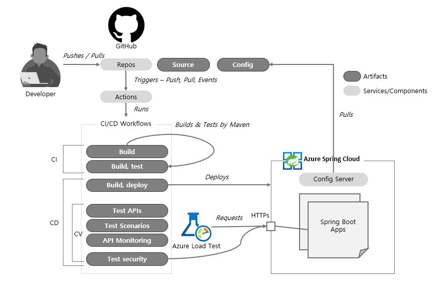

It implements 

* Automated pipelines for build and unit test, CI
  * Static test for the Java code 
  * Unit tests for the apps and the APIs 
* Automated pipelines for deployment with verification, CD
  * Load tests for the apps 
  * Synthetic monitoring for the APIs 
  * Security test for the app 

## 2. Workflows for Build and Test (CI)

Configuration of the pipeline looks like this which you can find from `.github/workflows/ci-build-test-customer.yml`

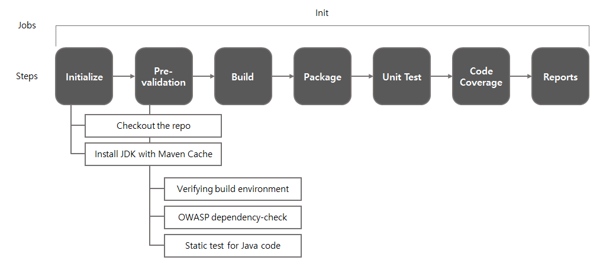

- Single job in the workflow
- Triggered by push and pull request to the repo or manually triggered
- No cache's required
- Includes pre-validation steps for tests
  - Verifing build environment such as JDK type and version, Maven version and so on
  - Dependency check, checks vulnarabilities from all dependencies in the Maven project
  - Static test for Java code
- Unit test by JUnit
- Code(Test) coverage

Number of 3rd party plugins were instrumented for this in Maven build file. And you can find Github Action plugins from Marketplace for more of [Code quality](https://github.com/marketplace?category=code-quality&type=actions) and [Code review](https://github.com/marketplace?category=code-review&type=actions)

At each steps, test results and reports may look like these

- Environment verification by enforcer plugin

Screenshot
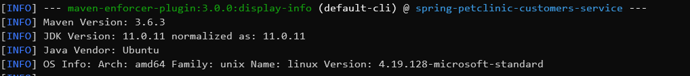

- OWASP vulnarability check by dependency-check plugin. 

Screenshot
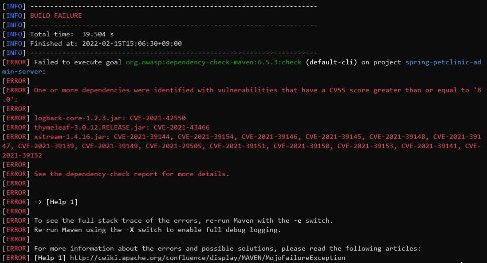

- Vulnarability checks for Java code by SpotBugs plugin.
  - What it looks like on the console, on succeed 

Screenshot
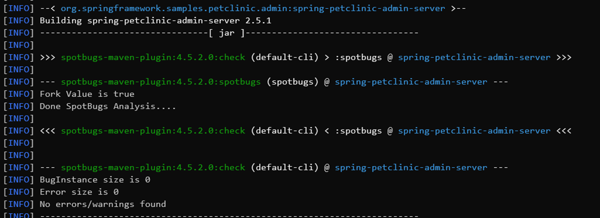

  - On the report in XML format, on succeed 

Screenshot
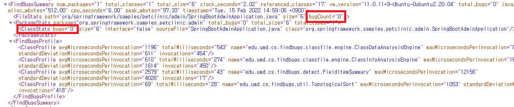

  - What it looks like on the console, on failure 

Screenshot
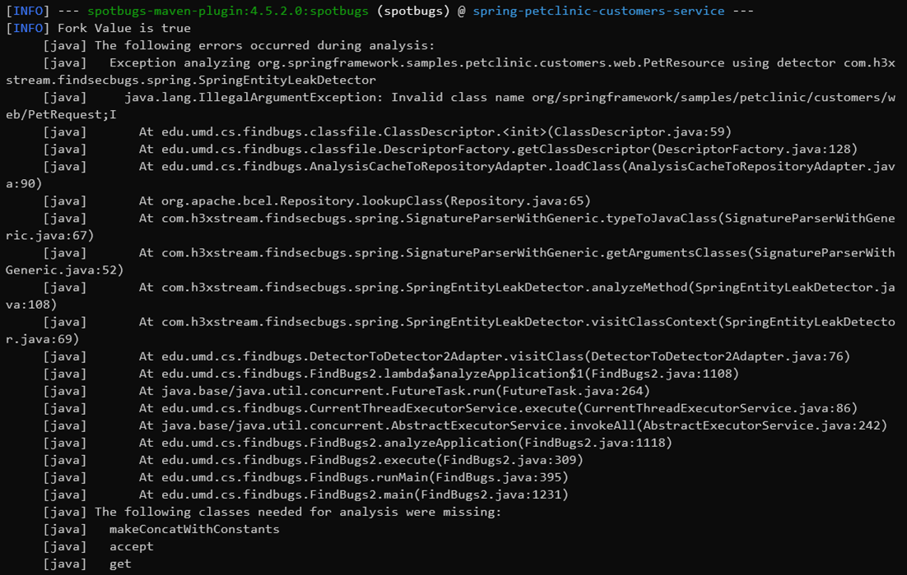

  - On the report, on failure 

Screenshot
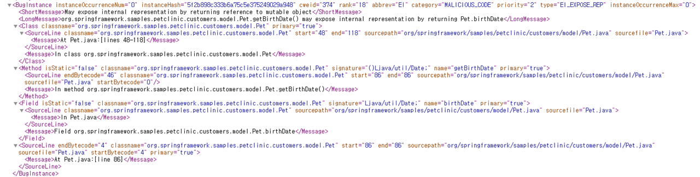

- Unit test results which defined in JUnit, on succeed 

Screenshot
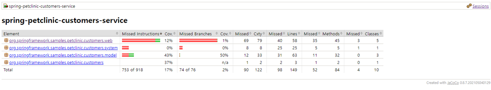

- Code coverage report by JaCoCo plugin.
  - Overview 

Screenshot

  - Browse by classes (code) 

Screenshot
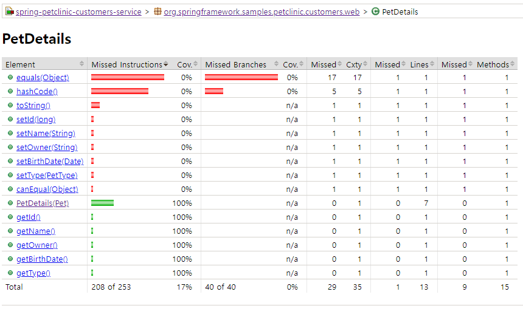

  - Browse by instances (runtime) 

Screenshot
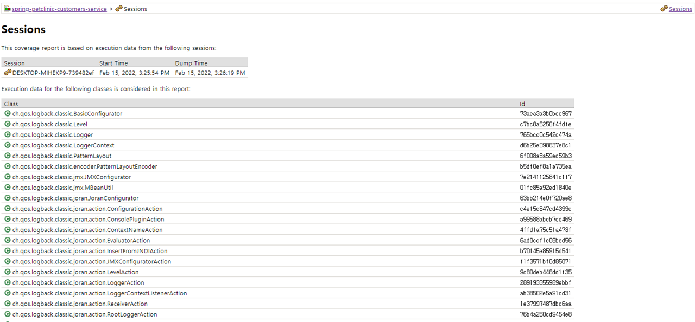

On your Github Action
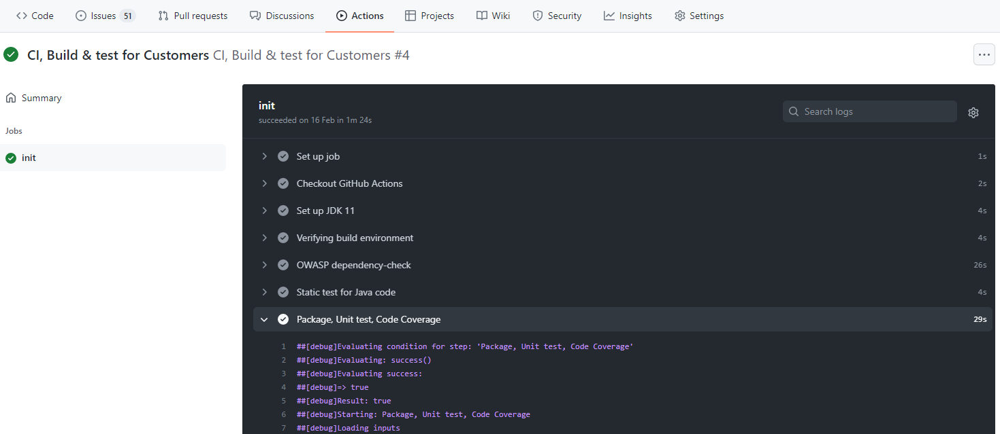

## 3. Workflows for Build, Test and Deploy (CI/CD)

Configuration of the pipeline looks like this which you can find from  `.github/workflows/cd-build-deploy-customer.yml`

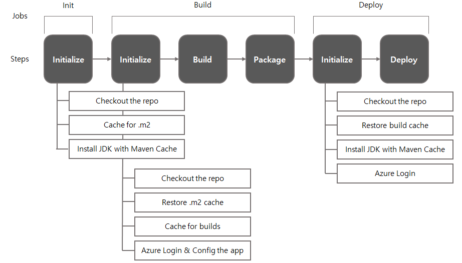

- Multiple jobs in the workflow - init, build, deploy skipping test
- Triggered by push and pull request to the repo or manually triggered
- Cache's configured 

Each jobs on Github Action runners start in a clean virtual environment and must download dependencies each time(jobs), causing increased network utilization, longer runtime, and increased cost. To help speed up the time it takes to recreate these files, GitHub can cache dependencies you frequently use in workflows

In this example there are 2 cache's defined for builds and deploys to store .m2 repo and app packages for each jobs

On your Github Action

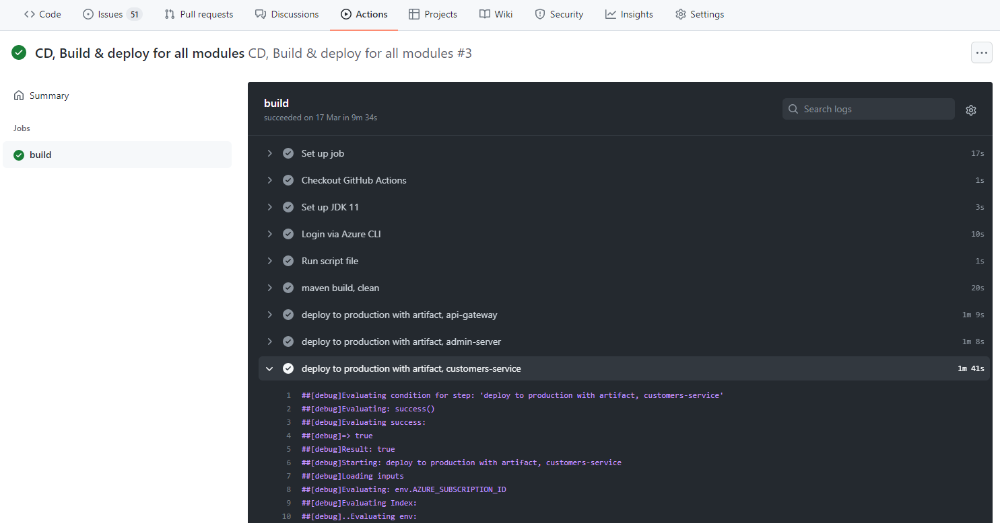

## 4. Workflows for Continuous Validation (CV)

Configuration of the pipeline looks like this which you can find from `.github/workflows/cv-tests-scenarios.yml`

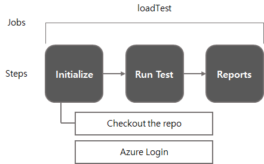

- Triggered by scheduled event 
- Same config's found from `cv-tests-apis.yml`, `cv-monitorings-apis.yml` 

These workflows calls Azure Load Testing with tests and test configs as arguments which you can find `tests` folder. Each tests needs to be configured separately on your Azure Load Testing resource on the portal, you can find instructions from [here](petclinic-test.md)

Test results are found from Azure Load Testing portal 

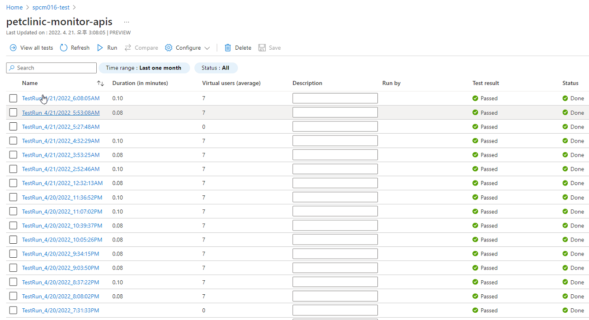

These tests are scheduled. You can schedule them to run at specific UTC times using POSIX cron syntax. Scheduled workflows run on the latest commit on the default or base branch. Find further details from [here](https://docs.github.com/en/actions/using-workflows/events-that-trigger-workflows#schedule)

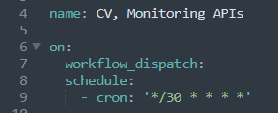

On your Github Action

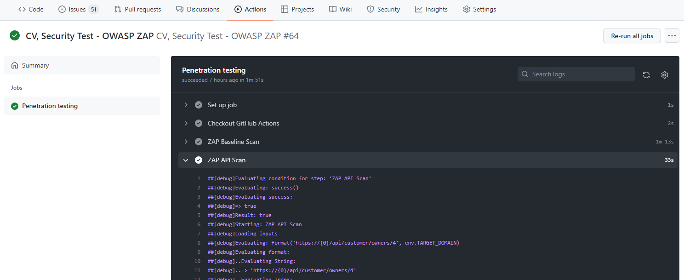

## 5. Workflows for Security(Penetration) Test (CV)

Configuration of the pipeline looks like this which you can find from `.github/workflows/cv-security-test.yml`

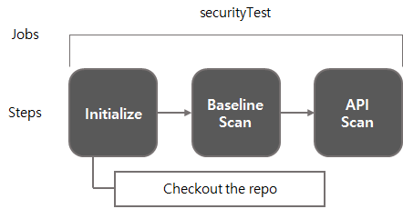

- Triggered by scheduled event 

In this example, ZAP pluin's used (https://www.zaproxy.org/) for (full scan), baseline scan and API scan. 

Penetration test in this example follows these stages:

- **Explore** – learns about the system being tested. This includes trying to determine what software is in use, what endpoints exist, what patches are installed, etc. It also includes searching the site for hidden content, known vulnerabilities, and other indications of weakness.
- **Attack** – exploits the known or suspected vulnerabilities to prove they exist.
- **Report** – reports back the results of their testing, including the vulnerabilities, how they exploited them and how difficult the exploits were, and the severity of the exploitation.

ZAP plugin posts the test results as Issue on your repo. Here's an example

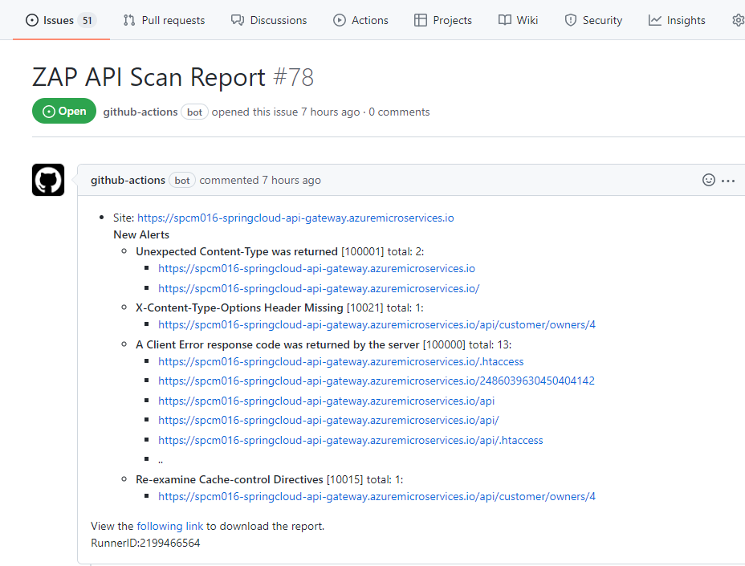

On your Github Action

For notifications, you can add notification in the final step at each workflows if neccessary by using plugins such as

- Posting failure as an issue on your repo, [Issues Notifier](https://github.com/marketplace/actions/issues-notifier)
- Sending failure over [Slack Notification](https://github.com/marketplace/actions/slack-notification)
- Sending failure over [Repository Notifications](https://github.com/marketplace/actions/repository-notifications)
- Sending failure over [Send mail Github Action](https://github.com/marketplace/actions/send-email)
- Sending failure over [SMS using Azure Logic Apps with Azure Communication Services] https://docs.microsoft.com/en-us/azure/communication-services/quickstarts/sms/logic-app

Overall, on your Github Action

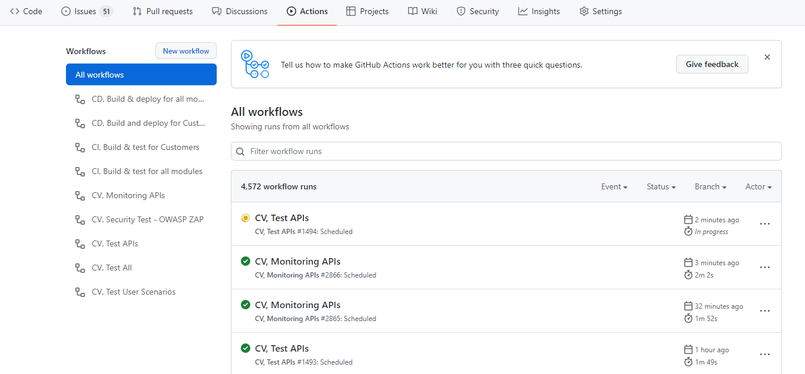

## Trademarks

This project may contain trademarks or logos for projects, products, or services. Authorized use of Microsoft trademarks or logos is subject to and must follow [Microsoft's Trademark & Brand Guidelines](https://www.microsoft.com/en-us/legal/intellectualproperty/trademarks/usage/general). Use of Microsoft trademarks or logos in modified versions of this project must not cause confusion or imply Microsoft sponsorship. Any use of third-party trademarks or logos are subject to those third-party's policies.