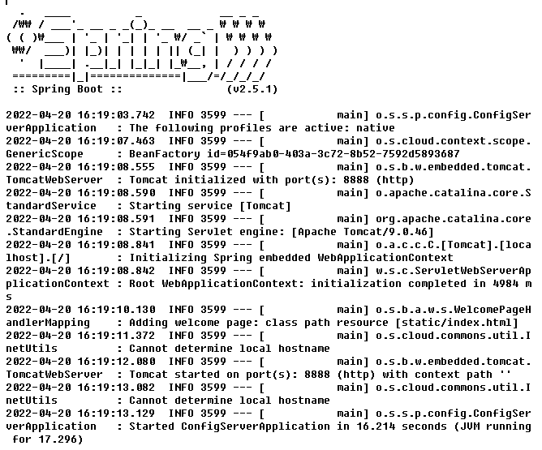
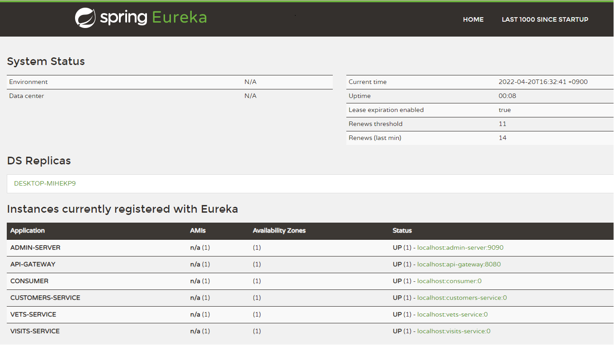
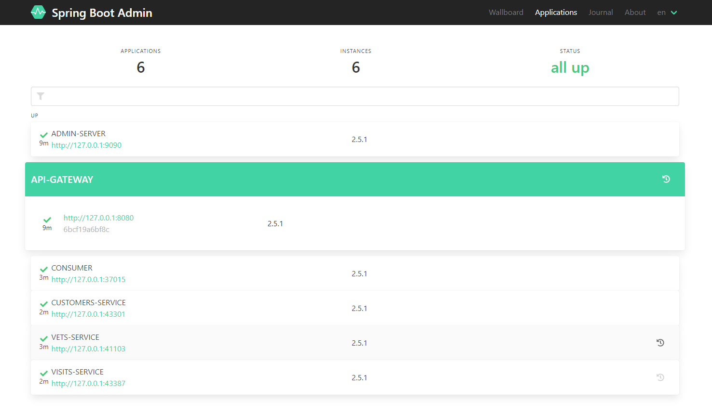
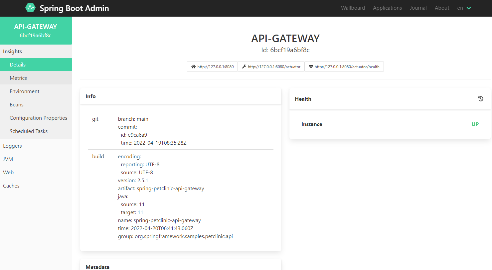
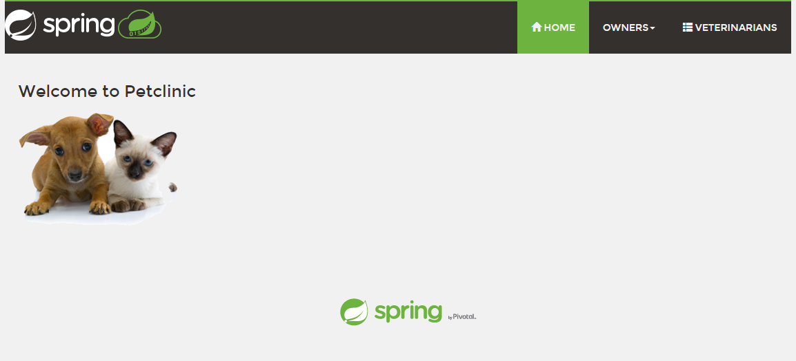
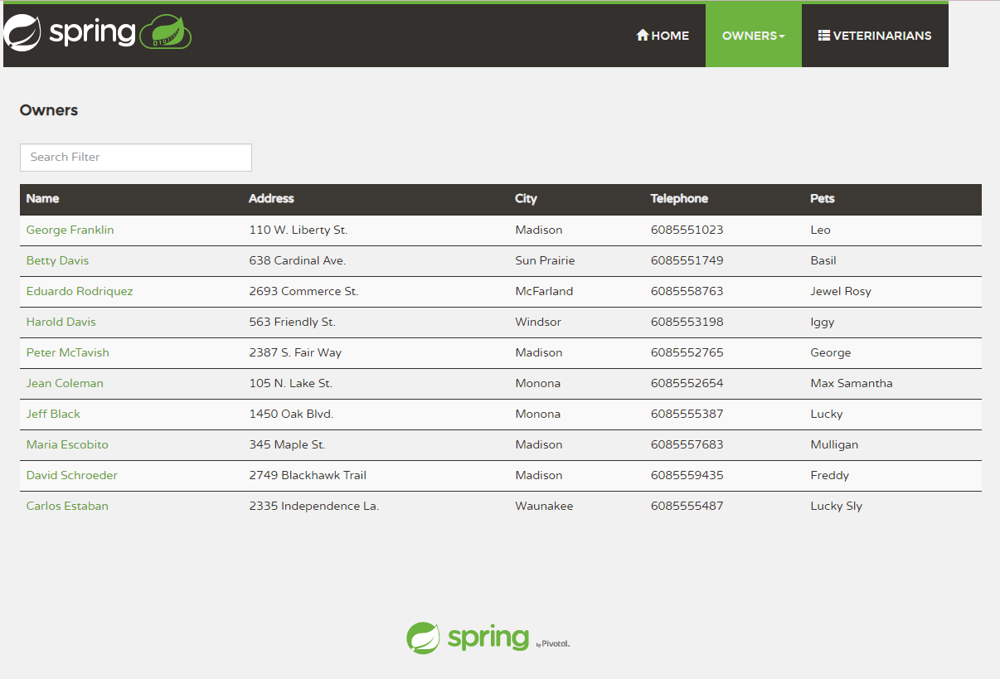

# Running PetClinic app locally

First you need to work through all steps to [Configure config-server by Azure Spring Apps](../README.md#configure-config-server-by-azure-spring-cloud) from the begining in the previous document [here](../README.md)

Running components in sequence

1. config-server 
2. discovery-server 
3. api-gateway 
4. admin-server 
5. consumer 
6. customers-service 
7. vets-service 
8. visits-service 

Be mindful that `discovery-server` and `api-gateway` requires `config-server`, and rest of servers/services requires `discovery-server` and `api-gateway`, so it has to be done in sequence

From the commandline, start `config-server` first

```bash

bin/run.sh config-server

```

It normally takes minutes. Check `config-server` logs from `logs`



Start `discovery-server`, `api-gateway` and `admin-server`

```bash

bin/run.sh discovery-server api-gateway
bin/run.sh admin-server

```

Then, run all the rest at once

```bash

bin/run.sh customers-service vets-service visits-service consumer 

```

After all components up, for Eureka Dashboard, `http://localhost:8761/` 



for Spring Boot Admin Console, `http://localhost:9090/` 




for PetClinic app, `http://localhost:8080/` 





## Trademarks

This project may contain trademarks or logos for projects, products, or services. Authorized use of Microsoft trademarks or logos is subject to and must follow [Microsoft's Trademark & Brand Guidelines](https://www.microsoft.com/en-us/legal/intellectualproperty/trademarks/usage/general). Use of Microsoft trademarks or logos in modified versions of this project must not cause confusion or imply Microsoft sponsorship. Any use of third-party trademarks or logos are subject to those third-party's policies.