# PetClinic Swagger/OAS3 for API Management Integration

Before you start, you need to deploy PetClinic app by working through all steps listed in the previous document [here](../README.md) and check everything works fine in your environment

Let's check Swagger UI first. [SpringFox](https://springfox.github.io/springfox/) is instrumented in this example at `api-gateway` and all three services - `customers-service`, `vets-service`, `visits-service`. It automatically generates the API specification which requires to integrate with APIM

Open `https://[Your project name]-springcloud-api-gateway.azuremicroservices.io/swagger-ui.html` 

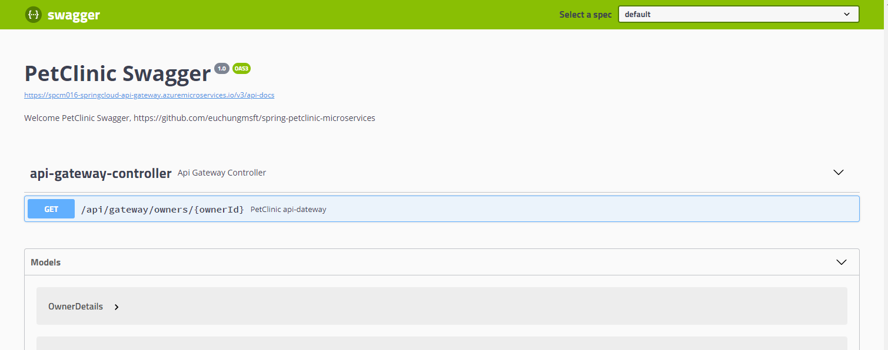

And check the source code `org.springframework.samples.petclinic.api.system.SwaggerConfig` at `api-gateway`

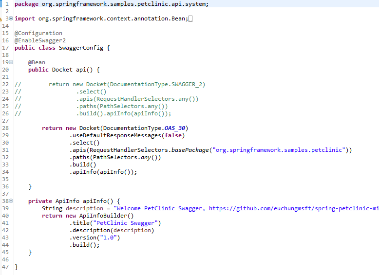

If you want to make some changes in header part of this Swagger UI, check `apiInfo()` method. Bean `api()` is to define version and scope of the api. In this example, it's on `OAS3`, Open API 3.0 and selects all APIs under `org.springframework.samples.petclinic` in this module

L22 ~ L26 is for Swagger v2 listing all APIs in this module.

If you have deployed all modules as instructed in the previous document, it's only opened for `api-gateway` as default. You can 'Assign Endpoint' at each 'Apps' on the portal for those three services

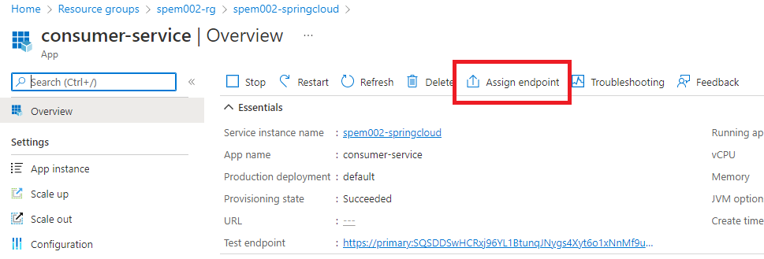

> Note: Azure API Management supports Open API 3. See [this](https://azure.microsoft.com/ko-kr/blog/announcing-the-preview-of-openapi-specification-v3-support-in-azure-api-management/) for further details

From your APIM portal, click on the APIM instance that you have created, and 'APIs' blade on the left, and click on 'Open API' item on the right under 'Create from definition'

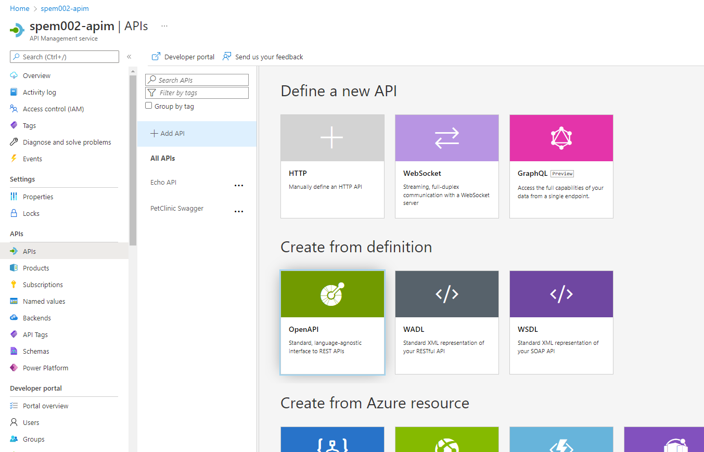

Click on 'Full' on top left. Copy API document URL from Swagger UI and paste it to 'OpenAPI specification'. It automatically fetches the API details - Display name, Name and Description

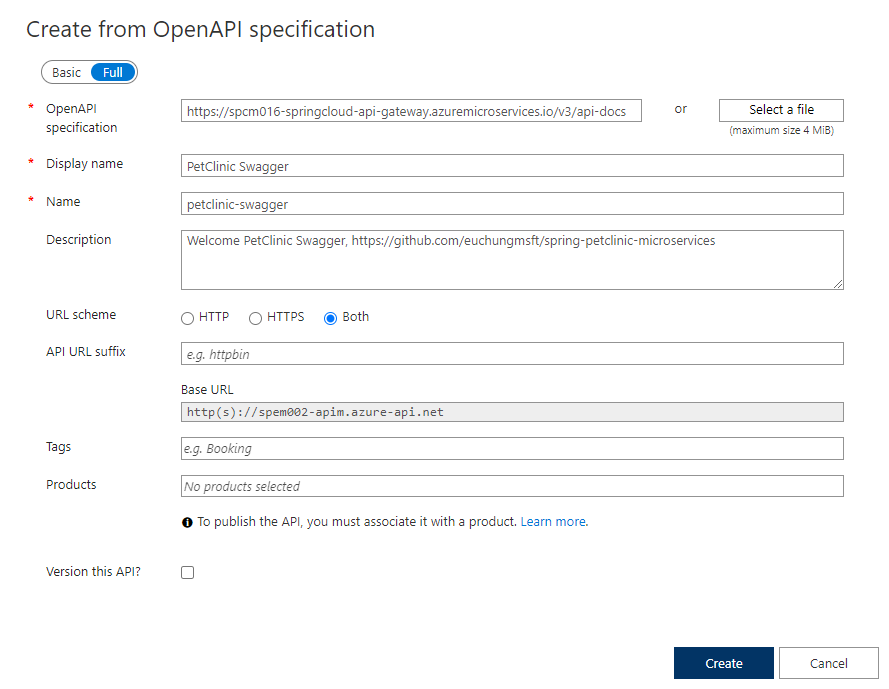

<!--
Put your 'API URL Suffix' for example `https://[Your project name]-springcloud-api-gateway.azuremicroservices.io` 

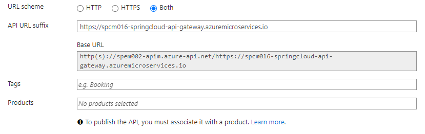
-->

Click on 'Create' button. 

Once the API creation's done successfully, it will look like this

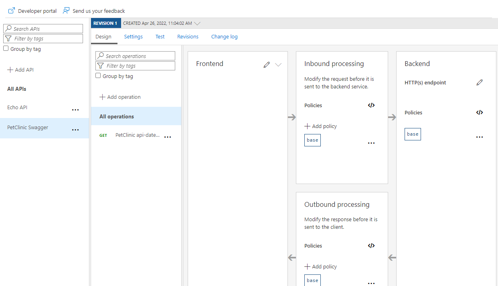

Click on Edit icon of 'HTTP(s) endpoint' on Backend, put 'Service URL' on the popup, and click on 'Save' button

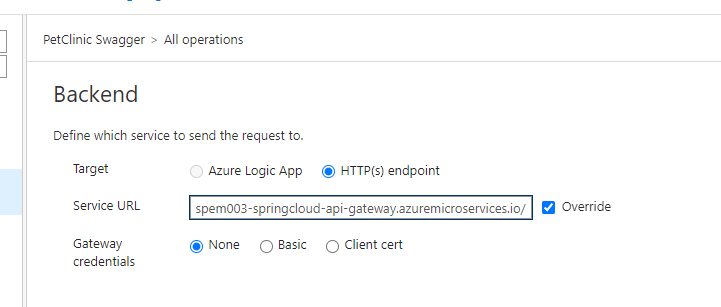

That's it !

Find `PetClinic Swagger API` from 'APIs' that you have created just now. It will look like this

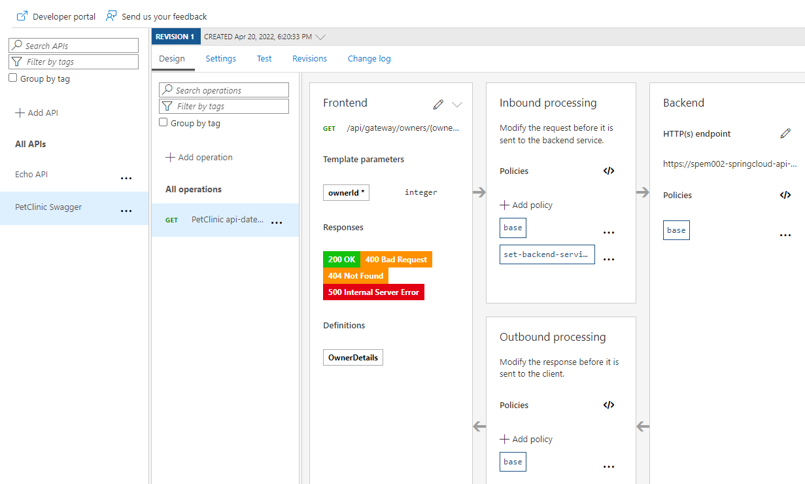

Click on 'Test' tab, and put '1' for 'ownerId'. We're trying to test `customers/owners` API over this APIM

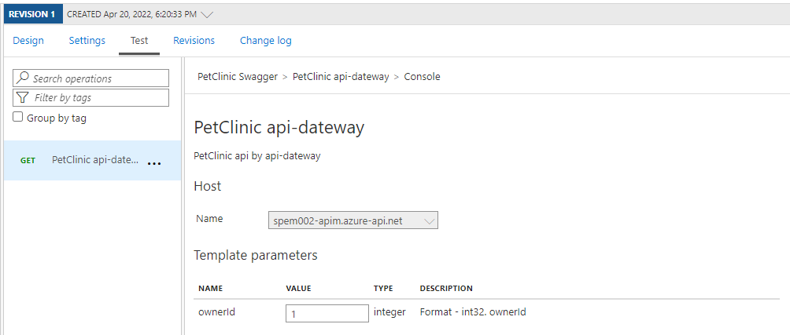

And click on 'Send'

It will look like this if test was successfully done

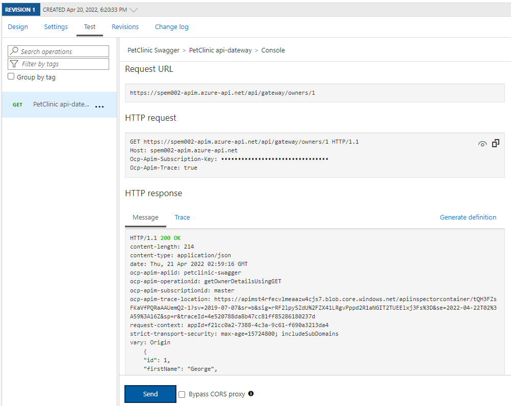

## Trademarks

This project may contain trademarks or logos for projects, products, or services. Authorized use of Microsoft trademarks or logos is subject to and must follow [Microsoft's Trademark & Brand Guidelines](https://www.microsoft.com/en-us/legal/intellectualproperty/trademarks/usage/general). Use of Microsoft trademarks or logos in modified versions of this project must not cause confusion or imply Microsoft sponsorship. Any use of third-party trademarks or logos are subject to those third-party's policies.