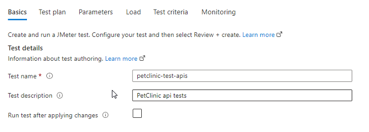

# Fully managed testing for PetClinic app

Azure Load Testing enables developers and testers to generate high-scale load and run simulations that reveal actionable insights into app performance, scalability, and capacity with a fully managed load-testing service. Get started quickly using existing Apache JMeter scripts, gain specialized recommendations backed by comprehensive metrics and analytics, and support continuous improvement through automated continuous integration and continuous delivery (CI/CD) workflows—all with a testing service built for Azure.

This example shows how to config managed testing for PetClinic by using Azure Load Testing. 

There you'll need to install [JMeter](https://jmeter.apache.org/download_jmeter.cgi) before you start, latest version's recommended

1. [Config test by using JMeter](#1-config-test-by-using-jmeter)
2. [Deploy the test to Azure Load Testing](#2-deploy-the-test-to-azure-load-testing)
3. [Evaluating the test](#3-evaluating-the-test)

## 1. Config test by using JMeter

Open `tests/petclinic-test-all.jmx` from JMeter

In the test plan, there you can find three Thread Groups on the left. 

- `user-scenario-01` is for scenario test navigating pages on PetClinic app which you may want to run for load testing/scenario testing. It only contains simple test cases by calling pages in GET method in this example, but you can add cookies, custom headers, authentications, assertions and so on upon your needs.

- `api-testing-01` is for API test. API test's configured for 4 apis. It's for synthetic monitoring for the APIs in operation. 

- `api-monitoring-01` is for monitoring which calls Spring Boot Actuator end-points instrumented in the app.

_What's **Synthetic Monitoring** ?_ It enables to identify problems and determine if a website or application is slow or experiencing downtime before that problem affects actual end-users or customers. This type of monitoring does not require actual traffic, thus the name synthetic, so it enables you to test applications 24x7, or test new applications prior to a live customer-facing launch to help provide visibility on application health during off peak hours when transaction volume is low. When combined with monitoring tools, synthetic monitoring can provide deeper visibility into end-to-end performance, regardless of where applications are running. 

Because synthetic monitoring is a simulation of typical user behavior or navigation through a website, it is often best used to monitor commonly trafficked paths and critical business processes. Synthetic tests must be scripted in advance, so it is not feasible to measure performance for every permutation of a navigational path an end-user might take. This is more suited for passive monitoring.

_What's **Spring Boot Actuator** ?_ Monitoring the Spring Boot app, gathering metrics, understanding traffic, or the state of our database become trivial with this dependency. The main benefit of Actuator is that you can get production-grade tools without having to actually implement these features yourself. 
Actuator is mainly used to expose operational information about the running application — health, metrics, info, dump, env, etc. It uses HTTP endpoints or JMX beans to enable us to interact with it.
Once this dependency is on the classpath, several endpoints are available for us out of the box. As with most Spring modules, we can easily configure or extend it in many ways.

On the right, you can see all variables externalized and parameterized for Azure Load Testing config.

For each of thread groups, you can find all settings with externalized arguments in each fields. You can define these arguments from environment variables on Azure Load Testing

For assertions, there's a few example's implemented in this example

It checks if the status is UP or it's failed

If eveything's fine with all settings above, click on '>' button on the toolbar or press Ctrl-R. After the test cycle's completed, you can find the results from each Listener items. For assertion results, it will look like this

Failed by mismatches, value expected to be zero-length string, but found '0.0'

## 2. Deploy the test to Azure Load Testing

Create a Azure Load Test resource

Location's limited on preview stage, select the closest region 

Go to the Azure Load Test resource that you have created just now, click on 'Tests' blade on the left, and click on 'Create Test' on the right. 

Name your test

Upload .jmx file that you have created in the previous step

Scale the test

Config failure/success criteria

Add resources to monitor while running the test

You can update all above settings at anytime you want

Test results are saved like this

## 3. Evaluating the test

Here's the test report as an example

## Trademarks

This project may contain trademarks or logos for projects, products, or services. Authorized use of Microsoft trademarks or logos is subject to and must follow [Microsoft's Trademark & Brand Guidelines](https://www.microsoft.com/en-us/legal/intellectualproperty/trademarks/usage/general). Use of Microsoft trademarks or logos in modified versions of this project must not cause confusion or imply Microsoft sponsorship. Any use of third-party trademarks or logos are subject to those third-party's policies.
